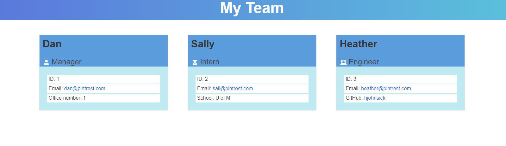

# Team Profile Generator

## Description:
The Team Profile Generator uses inquirer to prompt the user for information about their team.  Once the user has entered all of their team members, an html file is generated based on the input. This is a Node.js application.  A demo of the project can be found here, [Team Profile Generator Demo](https://watch.screencastify.com/v/metmmgB4MCL3rLAMg165).



## Prerequisites:
1. Install Node.js
2. Once Node.js is installed, cd in the root folder, team-profile-generator, and install the dependencies by running: 
```
npm install
```

## To Run the tests:
```
npm test
```

## To Run the Project:
```
node index.js
```

